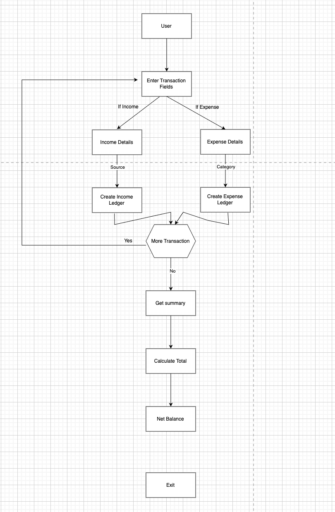
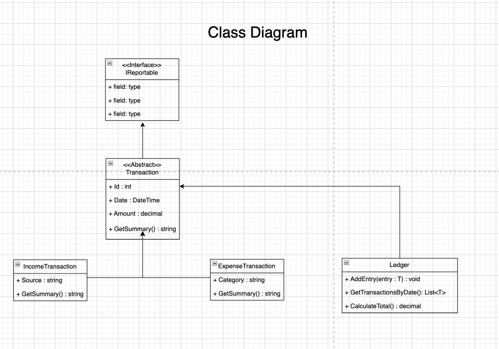
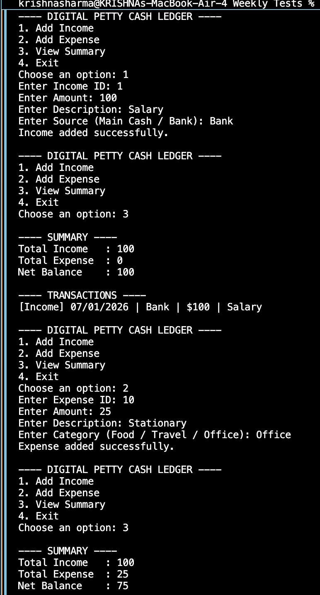

#  Digital Petty Cash Ledger System

This repository contains **two console-based C# projects** developed as part of assessment banks.  
Both projects follow **clean OOP principles**, **menu-driven flow**, and **console-based interaction**.

---


### 📝 Description
- A console-based financial utility designed to:
- Record Income (cash replenishments)
- Record Expenses (daily small expenditures)
- Calculate Total Income, Total Expenses, and Net Balance
- Display a polymorphic transaction summary
- Ensure compile-time type safety using generics

### 🔧 Key Concepts Used
- Object-Oriented Programming (OOP)
- Abstraction & Inheritance
- Polymorphism
- Generics with Type Constraints
- Collections (List<T>)
- Static Utility Class
- Menu-driven Console Interaction
- Input Validation

### Flow Chart


### Class Diagram


### 📸 Output Screenshot



### 🚀 Future Enhancements

Persistent storage (File / Database)
- Edit & delete transactions
- Date-based filtering
- ASP.NET Web API version
- Unit testing support

---

## ▶️ How to Run the Projects

```bash
dotnet run
